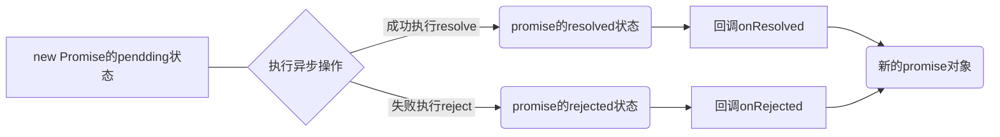

### Promise

#### Promise介绍与基本使用

##### Promise是什么

promise用来封装异步操作

###### 抽象表达

+ Promise是一门新的技术(ES6规范)

+ Promise是JS中进行异步编程的新解决方案(旧方案单纯使用回调函数)

  异步操作：

  + fs文件操作

    ```javascript
    require('fs').readFile('index.html',(err,data)=>{})
    ```

  + 数据库操作

  + Ajax

    ```javascript
    $.get('/server',(data)=>{})
    ```

  + 定时器

    ```javascript
    setTimeout(()=>{},2000)
    ```

###### 具体表达

+ 从语法上来说：Promise是一个构造函数
+ 从功能上来说：Promise对象用来封装一个异步操作并可以获取其成功/失败的结果值


##### Promise的状态改变

状态：实例对象中的一个属性 [PromiseState]

+ pending 未决定的
+ resolved / fulfilled 成功
+ rejected 失败

只存在两种state变化形式：

+ pending => resolved
+ pending => rejected

只有此两种，且一个Promise对象只能改变 一次，无论成功还是失败都会有一个结果数据，成功的结果数据一般称为value，失败的结果数据一般称为reason


##### Promise对象的值

实例对象中的另一个属性：[PromiseResult] 保存着异步任务成功/失败的结果

+ resolve
+ reject


##### Promise基本流程




##### 为什么要使用Promise

###### 指定回调函数的方式更加灵活

promise：启动异步任务 => 返回promise对象 => 给promise对象绑定回调函数

###### 支持链式调用，解决回调地狱问题

回调地狱：回调函数嵌套调用，不便于阅读和异常处理


#### Promise API

##### 构造函数excutor

+ executor函数：执行器(resolve,reject)=>{}
+ resolve函数：内部定义成功时调用的函数
+ reject函数：内部定义失败时调用的函数

executor会在Promise内部立即==同步==调用，异步操作在执行器中执行

##### .then()

```Promise.prototype.then```方法：(onResolved,onRejected)=>{}

+ onResolved函数：成功的回调函数
+ onRejected函数：失败的回调函数

回调时都会返回一个promise对象

##### .catch()

```Promise.prototype.catch```方法：(onRejected)=>{}

+ onRejected函数：失败的回调函数

##### Promise.resolve 方法

属于Promise对象的方法

+ 如果传入的参数为**非Promise类型**的对象，则返回的结果为成功Promise对象

  ```javascript
  let p1 = Promise.resolve(521)
  ```

+ 如果传入的参数为**Promise对象**，则参数的结果决定了resolve的结果

  ```javascript
  let p2 = Promise.resolve(new Promise((resolve,reject)=>{
      resolve('OK')
  }))
  ```

##### Promise.reject 方法

属于Promise对象的方法，返回失败的Promise对象

传入参数为Promise对象（resolve）时：返回结果为Promise对象，状态为rejected

```javascript
let p2 = Promise.reject(new Promise((resolve,reject)=>{
    resolve('OK')
}))
```

##### Promise.all 方法

promises：包含n个promise的数组。返回一个新的promise，只有所有的promise都成功才成功，只要有一个失败了就直接失败

```javascript
let p1 = new Promise((resolve,reject)=>{
    resolve('OK')
})
let p2 = Promise.resolve('Success')
let p3 = Promise.reject('Error')
const result = Promise.all([p1,p2,p3])
console.log(result);//失败的Promise对象
```

##### Promise.race 方法

###### promises：包含了n个promise的数组

返回一个新的promise，第一个完成的promise结果状态就是最终的结果状态

```javascript
let p1 = new Promise((resolve,reject)=>{
    setTimeout(() => {
        resolve('OK')
    }, 2000);
})
let p2 = Promise.resolve('Success')
let p3 = Promise.reject('Error')
const race = Promise.race([p1,p2,p3])
console.log(race);//返回Success的Promise
```


#### Promise 关键问题

+ **如何改变promise的状态**

  + resolve(value)：当前是pending就会变为resolved
  + reject(reason)：当前是pending会变为rejected
  + 抛出异常：如果当前是pending就会变为rejected

+ **一个promise指定多个成功/失败的回调函数时，当promise状态改为对应状态时都会调用**

+ **改变promise状态和指定回调函数的顺序(==resolve()==和==.then()==的先后顺序)**

  + 执行器里面的任务为同步时，resolve()先执行，.then后执行；异步时(如有setTimeout())反之

  + 先改变状态再指定回调的方式：

    1. 在执行器中直接调用resolve()/reject()
    2. 延迟更长时间才调用then()

  + 什么时候得到数据

    当执行器任务resolve()异步时，then(回调)先监听任务的状态，不执行，等resolve()中的任务得到结果时再执行then(回调)函数。

    （先指定了回调函数，再执行任务改变状态，必须等到状态改变得到结果时才进入异步队列执行回调函数：指定回调==> 改变状态 ==> 执行回调）总结：无论何种顺序，resolve（或执行器中的任务状态）优先级更高

+ **then执行结果**

  + 返回的Promise结果，由参数中的返回Promise状态决定(回调函数返回的结果)

+ **Promise串连多个操作任务**

  + promise的then()返回一个新的promise，可以开成then()的链式调用

  + 通过then()的链式调用串连多个同步/异步任务

    ```javascript
    let p = new Promise((resolve,reject)=>{
        setTimeout(()=>{
            resolve('OK')
        },2000)
    })
    p.then(value=>{
        return new Promise((resolve,reject)=>{
            resolve('Success')
        })
    }).then(value=>{
        console.log(value);
        //then返回promise对象的结果由回调函数的返回值决定，当第二个then中没有声明返回值时，下一个then获取到的value是undefined
    }).then(value=>{
        console.log(value)
    })
    ```

+ **promise的异常穿透**

  + 当使用promise的then链式调用时，可以在最后指定失败的回调

  + 前面任何操作出了异常，都会传到最后失败的回调中处理

    ```javascript
     p.then(value=>{
         console.log(111);
     }).then(value=>{
         console.log(222);
     }).catch(reason=>{
         console.log(reason);
     })
    ```

+ promise中断

  必须返回一个pending状态的promise对象才可以中断promise链条

  ```javascript
  return new Promise(()=>{})
  //只接受三个状态，resolved、rejected、pending，只有状态在pending时才会中断操作，其它两个状态时才会调用回调函数 不调用===中断
  //如果中断前有状态为失败时，后面的catch还是会输出
  ```

  

#### Promise 自定义封装

#### async与await

##### async

+ async返回的就是promise对象

##### await

+ await右侧表达式一般为promise对象，但也可以是其它的值
+ 如果表达式是promise对象，await返回的是promise成功的值
+ 如果表达式是其它值，直接将此值作为await的返回值

##### 注意事项

+ await必须写在async函数中，但async函数中可以没有await
+ 如果await的promise失败了，就会抛出异常，需要通过try…catch处理

```javascript
let fa = async () => {
    let p = new Promise((resolve,reject)=>{
        resolve('OK')
    })
    //1.右侧为promise的情况
    let res = await p
    //2.右侧为其它类型的数据 不常见
    let res2 = await 20;
    //3.如果Promise是失败的状态
    let p1 = new Promise((resolve,reject)=>{
        reject('Error')
    })    
    try {
        let res3 = await p1
    } catch (error) {}
}
fa()
```

##### 与ajax结合使用(常用axios)

```javascript
function sendAJAX(url) {
    return new Promise((resolve, reject) => {
        const xhr = new XMLHttpRequest
        xhr.responseType = 'json'
        xhr.open('GET', url)
        xhr.send()
        xhr.onreadystatechange = function () {
            if (xhr.readyState === 4) {
                if (xhr.status >= 200 && xhr.status <= 300) {
                    resolve(xhr.response)
                } else {
                    reject(xhr.status)
                }
            }
        }
    })
}
let btn = document.querySelector('#btn')
btn.addEventListener('click',async function(){
    let duanzi = await sendAJAX('https://api.apiopen.top/getJoke')
    console.log(duanzi);
})
```

